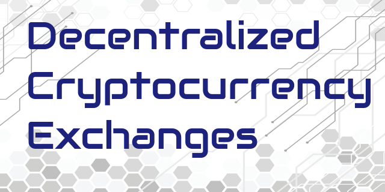

# Decentralized Cryptocurrency Exchanges (DEX)

This is a definitive list of the best decentralized cryptocurrency exchanges available. By their nature, these can be used by anyone simply by connecting a wallet such as Metamask or Trust Wallet. There's no need for any registration or Know Your Customer (KYC), meaning no personal information ever changes hands. All have been verified as reputable and well established platforms.

**Decentralized Exchanges (DEX) - Top 5:**

- [Afradex](https://afradex.com) - DEX aggregator that allows for trading across many different blockchains including Ethereum, Polygon, Arbitrum and more.
- [UniSwap](https://uniswap.org) - Largest DEX for Ethereum and Polygon tokens, as well as other EVM compatible blockchains.
- [Raydium](https://raydium.io) - Largest DEX for the Solana ecosystem.
- [PancakeSwap](https://pancakeswap.finance) - Largest DEX for Binance Smart Chain tokens. Also supports Arbitrum, Ethereum and other EVM chains. 
- [Orca](https://orca.so) - Second largest DEX for the Solana ecosystem.

**Other Decentralized Cryptocurrency Exchanges:**

- [QuickSwap](https://quickswap.exchange) - Large DEX dedicated to the Polygon ecosystem.
- [SushiSwap](https://sushi.com) - DEX supporting a range of EVM blockchains including Ethereum, Polygon and Binance Smart Chain.
- [Camelot](https://camelot.exchange) - Largest DEX dedicated to Arbitrum, an Ethereum layer 2 ecosystem.
- [SunSwap](https://sun.io) - Largest DEX for the Tron blockchain.
- [TraderJoe](https://traderjoexyz.com) - Largest DEX for the Avalanche blockchain, whilst also supporting Arbitrum.
- [Osmosis](https://osmosis.zone) - Largest DEX for the Cosmos / Osmosis ecosystems.
- [STON.fi](https://ston.fi) - Largest DEX for the TON blockchain.

Note that I am not connected to any of the platforms above and am therefore not responsible for the content on these sites.
